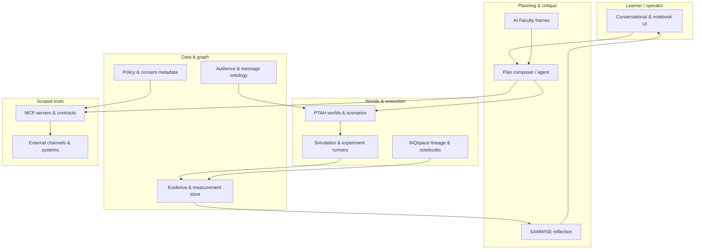

# Mag.AI-Marketing — Platform Design

**Castalia Institute — Magisterium**

*Complements `DESIGN.md` (pedagogy and degree). This document describes the **software and integration architecture** students build toward and run on.*

---

## I. Purpose

The **platform** is the executable layer of Mag.AI-Marketing: where **audience worlds**, **simulations**, **reflection**, **tool contracts**, and **lineage** live. Teaching and building share the same primitives—graduates leave with **artifacts that map to real system components**, not only narratives.

**Goals**

1. **Single loop** — define → simulate → measure → revise → deploy, with **inspectable** history.
2. **Judgment-preserving AI** — models and agents **expose assumptions** and **scoped actions**; they do not replace ethics or brand accountability.
3. **Build systems literacy** — students implement and extend **schemas, servers, and workflows** that embody marketing mechanics; vendor UI training is out of scope for the credential (see `DESIGN.md`).
4. **Interoperability without capture** — external channels and data connect through **explicit contracts** (e.g. MCP); the platform remains the **locus of ontology, runs, and evidence**.

---

## II. Design principles

| Principle | Implication |
| --- | --- |
| **Simulation first** | Every “plan” is testable against a **world model** or **experiment spec** before scale. |
| **Artifacts, not vibes** | Plans, models, and runs are **versioned objects** reviewers can open—not chat transcripts alone. |
| **Explicit scope** | Tools (APIs, data pulls, sends) are **named, least-privilege, logged** (`MCP_MARKETING.md`). |
| **Lineage everywhere** | Inputs → assumptions → code/config → outputs → decisions are **linked** for defense and compliance. |
| **Substitutability** | Core outcomes must survive **faculty-approved fallbacks** (notebooks, Git, synthetic endpoints) if a component is unavailable (`DESIGN.md`, instructional stack). |

---

## III. Conceptual architecture

High-level data and control flow:



**Reading the diagram**

- **Planner** turns goals and constraints into **structured plans** (phases, dependencies, tools, falsifiable assumptions)—similar in *role* to an IDE plan, but domain-specific.
- **PTAH + Sim** are the **marketing world** execution core.
- **SAMWISE + Faculty** provide **reflection and challenge**, not single-answer optimization.
- **MCP** is the **controlled bridge** to real or synthetic marketing stacks; it is not a parallel undocumented shell.
- **iNQspace** is the **default home** for notebooks, runs, and reproducible lineage.

---

## IV. Core primitives (platform vocabulary)

These names should stay **aligned across courses, docs, and code** so agents and humans share one ontology.

| Primitive | Meaning |
| --- | --- |
| **World** | Executable model: agents, rules, channels, measurement hooks (PTAH-shaped). |
| **Scenario** | A named perturbation bundle applied to a world (message, price, channel mix, shock). |
| **Run** | Immutable record: world version + scenario + seed + outputs + environment fingerprint. |
| **Plan** | Structured artifact: goals, assumptions, steps, tools, success criteria, rollback—**not** raw chat. |
| **Evidence** | Quantitative or qualitative inputs **with provenance** (source, time, bias notes). |
| **Policy** | What automation may do, to whom, under which consent and brand rules. |
| **Lineage** | DAG from evidence and configs to decisions and deployments (thesis-grade traceability). |

---

## V. Major subsystems

### 1. iNQspace (execution & lineage)

- **Role:** Primary lab: notebooks, scheduled runs, integration with models, **versioned artifacts**.
- **Platform responsibility:** Stable project model, secrets handling, run logs, export paths for defense.

### 2. PTAH (world construction)

- **Role:** Ontology, rules, population / message / channel dynamics; **forkable worlds** for comparison.
- **Platform responsibility:** Schema validation, scenario libraries, deterministic replay where required for grading.

### 3. SAMWISE (reflection)

- **Role:** Structured critique: assumptions, blind spots, mismatch between model and evidence.
- **Platform responsibility:** Reflection **templates** tied to runs and plans; optional LLM assist with **fixed rubrics**.

### 4. Planner / plan composer (agent layer)

- **Role:** From natural-language goals + product/audience context, produce **Plan** primitives (Section IV), refine under Faculty/SAMWISE, and **dispatch** scoped tool calls.
- **Platform responsibility:** **Schema-first** plans (machine-checkable), tool allowlists, audit log, human approval gates for high-risk actions.

### 5. MCP tool plane

- **Role:** Inspectable connections to analytics, ads, content, enrichment, **or faculty-hosted synthetic** endpoints (`MCP_MARKETING.md`).
- **Platform responsibility:** Server registry, credential scoping, **no silent breadth expansion**.

### 6. Content & credential layer (this repository)

- **Role:** Public and cohort-facing **authoritative** syllabi, policies, and program hub; builds to static sites.
- **Platform responsibility:** Single source of truth for **what the program promises**; links into iNQspace where execution lives.

---

## VI. Data model (logical)

Not a prescription for one database technology, but **required relationships**:

- **World** ∋ versions; each version links to **ontology** definitions and **code/config** blobs.
- **Run** references **World version** + **Scenario** + **Runner** revision.
- **Evidence** stores **summary, provenance, bias_and_limits**, optional **snapshot_ref** and MCP linkage (§IX schema).
- **Plan** references **Run**s and **Evidence** items; status transitions (draft → approved → superseded).
- **Tool invocation** records: server id, tool name, arguments hash, time, principal, outcome summary.

Privacy and consent metadata attach to **datasets** and **policies**, not only to “contacts.”

---

## VII. Phased delivery (platform)

| Phase | Focus | Graduate-visible outcome |
| --- | --- | --- |
| **P0 — Foundations** | iNQspace + PTAH + lineage for Term I worlds | Runnable worlds with reproducible runs |
| **P1 — Evidence loop** | Evidence store, measurement hooks, MCP read-heavy paths | Plans tied to **pulled** metrics and documented bias |
| **P2 — Planner** | Schema-first plans, gated tool execution, SAMWISE integration | Describe goals → get **reviewable** multi-step plan |
| **P3 — Automation & governance** | Policy engine, escalation, audit for sends and bulk actions | Aligns with Term III automation and ethics courses |

Phases may **overlap** with curriculum waves; nothing in P2–P3 should be a **hidden prerequisite** for core Magisterium outcomes (see fallbacks in `DESIGN.md`).

### P0 — MVP checklist (what ships first)

Concrete capabilities iNQspace (and PTAH bindings) should expose so **Term I** artifacts are gradable and reproducible without P1–P3.

| # | Capability | Done when |
| --- | --- | --- |
| P0.1 | **Project workspace** | Student has a durable project id; artifacts are not orphaned notebook cells. |
| P0.2 | **World versioning** | Each World has monotonic versions; a version points to ontology + runnable asset (notebook bundle, config, or declared runtime). |
| P0.3 | **Scenario library** | At least one named Scenario can be attached to a World version and re-run. |
| P0.4 | **Run record** | Each execution produces a **Run** with: world version id, scenario id, seed (if applicable), stdout/summary metrics blob, timestamp, runner revision. |
| P0.5 | **Lineage export** | One-click or scripted export suitable for defense: manifest listing inputs, versions, and outputs (JSON + files or zip). |
| P0.6 | **Secrets boundary** | No secrets in artifact export; env references documented in run metadata. |
| P0.7 | **Fallback path** | Same checklist satisfiable with **Git + local notebooks** if iNQspace is unavailable (faculty policy), with explicit equivalence notes in the artifact. |

Nothing here **requires** MCP or an LLM planner; P0 is the floor for **World Construction** and **Simulation Quality** dimensions (`ASSESSMENT.md`).

### P1 — MVP checklist (evidence + MCP read paths)

Concrete capabilities so **Term II** (and late Term I where assigned) can tie models to **signals with provenance**, not screenshots—still **read-heavy** MCP by default; writes stay gated until P3 policies are explicit.

| # | Capability | Done when |
| --- | --- | --- |
| P1.1 | **Evidence store** | Evidence rows persist with **id**, **kind**, **summary**, and **provenance** (see §IX schema). |
| P1.2 | **Link to runs** | An Evidence can reference **Run** ids and **World** versions; mismatch between model and data is documented. |
| P1.3 | **MCP registry** | Approved servers are listed with **tool manifests**; students attach **mcp_invocation_id** to tool-backed Evidence when applicable (`MCP_MARKETING.md`). |
| P1.4 | **Read-only default** | Course MCP surfaces default to **pull** (metrics, lists, exports); destructive tools require explicit allowlist + approval path. |
| P1.5 | **Bias & limits** | Evidence records require **bias_and_limits** (can be “unknown—documented”) before feeding a graded Plan or thesis chapter. |
| P1.6 | **Synthetic parity** | Faculty-hosted or **synthetic** endpoints produce Evidence with `kind: synthetic` and same schema shape as live pulls. |
| P1.7 | **Snapshot refs** | Quantitative rows reference **snapshot_ref** (or equivalent) so a reviewer can reason about **what slice of time** the numbers represent. |

P1 supports **Insight** and **Deployment** dimensions where evidence backs claims (`ASSESSMENT.md`); it does **not** require the Planner (P2).

---

## VIII. Plan artifact (JSON Schema)

The **Plan** primitive (Section IV) is **schema-first** so agents, graders, and UIs share one contract. Canonical definition:

- **[`agora/schemas/agora-plan.schema.json`](https://github.com/InquiryInstitute/agora/blob/main/schemas/agora-plan.schema.json)** (Agora repo) — JSON Schema (draft 2020-12); copy under `docs/schemas/magai-plan.schema.json` here for the book build.

**Minimal valid plan (illustrative):**

```json
{
  "schema_version": "1.0.0",
  "plan_id": "550e8400-e29b-41d4-a716-446655440000",
  "status": "draft",
  "title": "Test positioning before Q3 spend",
  "goal": "Choose one primary narrative with documented downside risk.",
  "context": {
    "product_summary": "B2B analytics for regional banks.",
    "audience_hypothesis": "CFO-led buying committee; trust is the bottleneck.",
    "constraints": ["No claims we cannot cite", "8-week window"]
  },
  "assumptions": [
    {
      "id": "a1",
      "statement": "Trust gap is larger than price sensitivity.",
      "falsify": "Pilot shows price objections dominate in >50% of losses.",
      "confidence": "medium"
    }
  ],
  "steps": [
    {
      "id": "s1",
      "title": "Encode audience world + two narrative scenarios",
      "depends_on": [],
      "success_criteria": ["Two scenarios differ only in narrative lever", "Run completes with stable seed"]
    },
    {
      "id": "s2",
      "title": "Compare outcomes under stress shocks",
      "depends_on": ["s1"],
      "success_criteria": ["Worst-case tail documented for each narrative"]
    }
  ]
}
```

**Phasing vs schema:** P2 expects full validation against the schema for **authoring**; earlier phases may use **subset** fields (e.g. `steps` without `tool_allowlist`) but should not invent parallel field names—extend the schema with a version bump instead.

---

## IX. Evidence artifact (JSON Schema)

The **Evidence** primitive (Section IV) is stored as its own record so Plans, Runs, and defenses **cite the same object**. Canonical definition:

- **[`agora/schemas/agora-evidence.schema.json`](https://github.com/InquiryInstitute/agora/blob/main/schemas/agora-evidence.schema.json)** (Agora repo) — JSON Schema (draft 2020-12); copy under `docs/schemas/magai-evidence.schema.json` here for the book build.

**Minimal valid evidence (illustrative):**

```json
{
  "schema_version": "1.0.0",
  "evidence_id": "ev-2026-03-29-site-baseline",
  "kind": "tool_pull",
  "summary": "GA4-style sessions and engaged sessions for property X, week of 2026-03-10.",
  "provenance": {
    "source_type": "analytics_export",
    "retrieved_at": "2026-03-17T14:00:00Z",
    "uri": "export-batch-internal-4412"
  },
  "bias_and_limits": [
    "Consent mode may suppress part of EU traffic.",
    "Definition of 'engaged' is platform-default, not custom."
  ],
  "snapshot_ref": "snap-analytics-4412-v1"
}
```

**Joins:** `Plan.evidence_refs[].evidence_id` → Evidence.`evidence_id`. Optional `links.run_id` / `links.world_version_id` connect to the simulation and measurement story.

---

## X. Security & governance (minimum bar)

1. **Secrets** — Never in Git; environment or platform vault (`MCP_MARKETING.md`).
2. **Least privilege** — Tool manifests list **exact** operations; broad “admin” surfaces are out of scope for coursework defaults.
3. **Human-in-the-loop** — Irreversible or high-blast-radius actions require explicit approval in the Plan state machine.
4. **Reproducibility** — Thesis artifacts must cite **world version + scenario + data snapshot id** where applicable.

---

## XI. Ecosystem touchpoints

| System | Relationship |
| --- | --- |
| **Mag.AI-Business** | Shared customer/funnel **mechanics** where credentials align; avoid duplicate ontology names. |
| **Castalia Magisterium site** | This repo and siblings publish **truth** for cohorts and public readers. |
| **Agora** | Executable **platform** — canonical [Plan & Evidence schemas](https://github.com/InquiryInstitute/agora/tree/main/schemas), examples, and implementation; this program is the specification and teaching layer. |
| **External marketing stacks** | **Consumers** of MCP (or batch exports); not the authority for **world definition** or **defense**. |

---

## XII. Document map

| Document | Scope |
| --- | --- |
| `DESIGN.md` | Degree philosophy, curriculum, PTAH/SAMWISE/Faculty roles, assessment framing |
| `MCP_MARKETING.md` | Tooling policy, guardrails, equity |
| `ASSESSMENT.md` | How artifacts are judged (feeds platform “what must be inspectable”) |
| **`PLATFORM.md` (this file)** | Software architecture, primitives, phases, P0/P1 checklists |
| **[InquiryInstitute/agora](https://github.com/InquiryInstitute/agora)** | **Agora** platform repo — canonical **`agora-plan.schema.json`** and **`agora-evidence.schema.json`** |
| **`schemas/magai-*.schema.json` (this repo)** | Mirrors aligned with Agora; prefer the **agora** repo for validation and `$id` resolution. |

---

## Legal

> The Castalia Institute Magisterium confers proprietary credentials based on demonstrated work and evaluation. These credentials are not accredited academic degrees and do not confer professional licensure.
